#PublicCMS

##功能列表

* 内容管理
* 分类管理
* 标签管理
* 标签分类管理
* 页面管理
* 模板管理
* 模型管理
* 模块管理
* 任务计划管理
* 用户管理
* 部门管理
* 角色管理
* 日志管理

##简介
PublicCMS 使用了FreeMarker 2.3.23,SpringMVC 4.2.1.RELEASE,Hibernate 5.0.2.Final,hibernate-search5.5.0.Final等技术及框架,工程编译等工作由Gradle处理，运行部署需要jdk1.7+,tomcat7.0+/jetty8.0+,nginx/apache,mysql5.0+
通过不同那个的配置方式PublicCMS 支持全站静态化/全站动态，

##授权
该软件永久开源免费(MIT 授权协议)

##结构说明
* publiccms-admin为JAVA Web工程，其中包含了管理后台和前台站点的动态部分
* publiccms-admin-by-gradle为Gradle管理的工程，publiccms-admin-by-maven为Maven管理的工程，两个工程中源码是一样的
* data/www/publiccms.com为PublicCMS的 数据目录其中：static子目录为静态化页面文件存储目录，upload上传文件与站点其他静态资源存储目录，template为静态化页面模板文件存储目录，data/indexes子目录为Hibernate Search/lucene索引文件目录，data/pages子目录为PublicCMS推荐位数据存储目录
* nginx-conf为PublicCMS的nginx配置文件，该文件为本开源项目 http://www.publiccms.com/ 官网使用的配置文件副本
* database/Database Init-***.sql为PublicCMS项目数据库初始化脚本，Database Change Log.sql为数据库变更记录

##编译部署
* publiccms-admin-by-gradle工程编译(eclipse为例)：选择工程，右键弹出菜单中选择"Run As",在子菜单中选择"Gradle build"，在弹出的对话框中输入"war",点击按钮"Run"。在Console中可以看到编译过程日志，如果编译成功，您可以在工程下面 build/lib 目录下找到编译完成的 war包
* publiccms-admin-by-maven工程编译(eclipse为例)：选择工程，右键弹出菜单中选择"Run As",在子菜单中选择"Maven install"。在Console中可以看到编译过程日志，如果编译成功，您可以在工程下面 target 目录下找到编译完成的 war包
* 请根据实际情况修改数据库配置文件publiccms-admin/src/config/properties/dbconfig.properties
* PublicCMS支持全站静态化，如果您打算使用静态化、SSI技术，推荐您使用nginx发布PublicCMS生成的静态页面，和其他静态资源文件
* 静态化模板文件路径、静态页面文件路径、静态站点域名等信息需要同时修改 publiccms-admin/src/config/properties/other.properties 和 nginx配置文件
* 内置管理员账号admin，密码admin

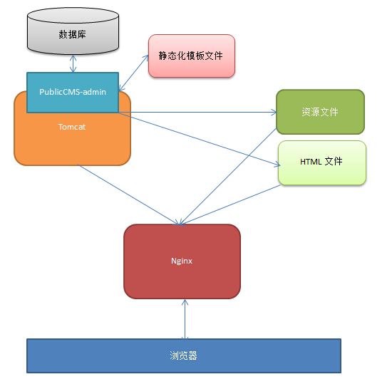

##其他
* 如果您没有使用过gradle或者maven，并且不打算使用它们，也可以在https://github.com/sanluan/PublicCMS-lib 或 https://git.oschina.net/sanluan/PublicCMS-lib 下载PublicCMS依赖的库，将其放在工程的WEB-INF\lib 目录下，并加入到build path中
* 演示站点：http://www.publiccms.com/
* 动态站点演示：http://cms.publiccms.com/
* 后台演示：http://cms.publiccms.com/admin/ 账号/密码 test/test

##系统后台截图
###工作台
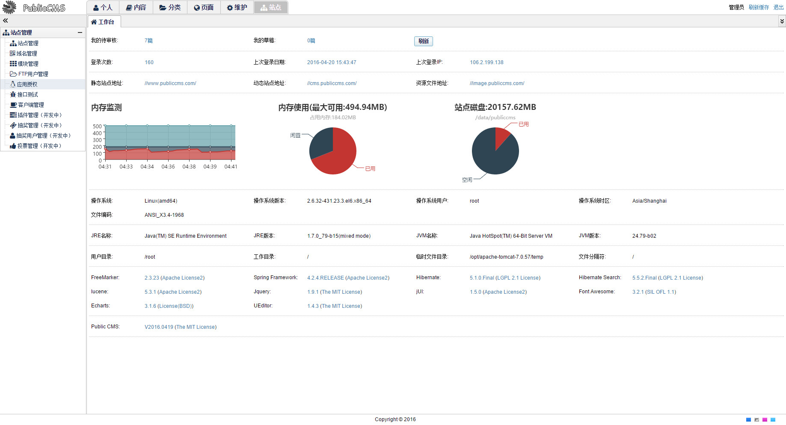
###内容列表
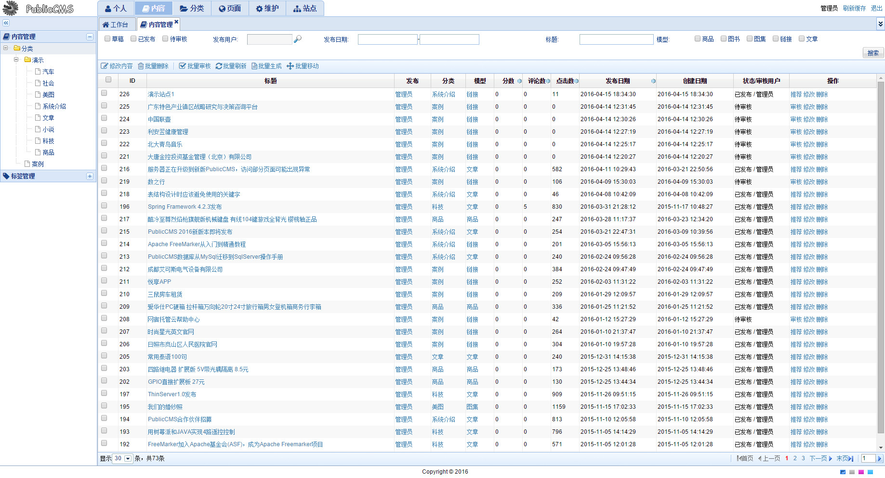
###内容编辑
编辑器为百度编辑器，支持定时发布等功能
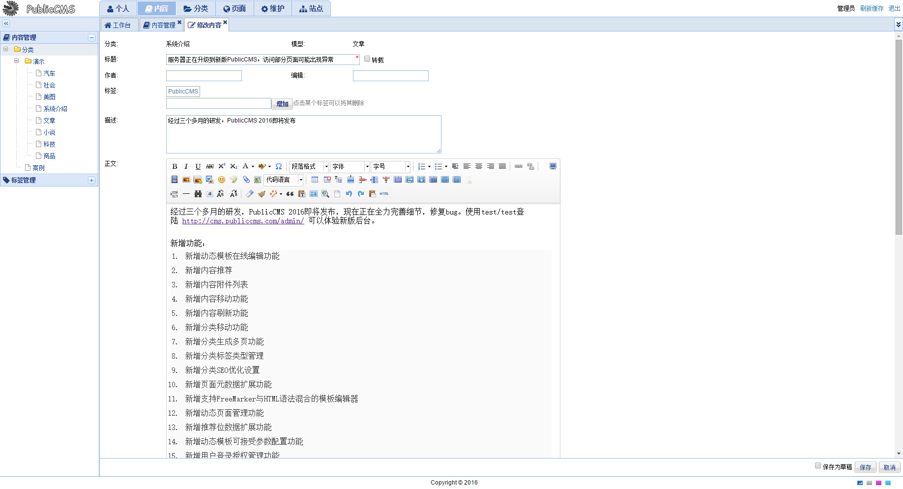
###图集编辑
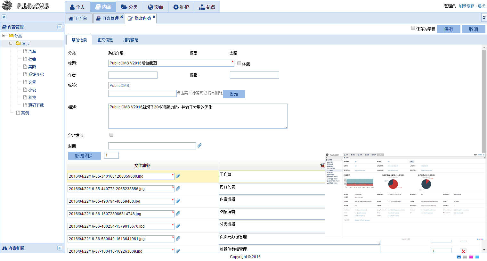
###分类编辑
分类支持4个可查询系统扩展字段，和无限自定义字段扩展
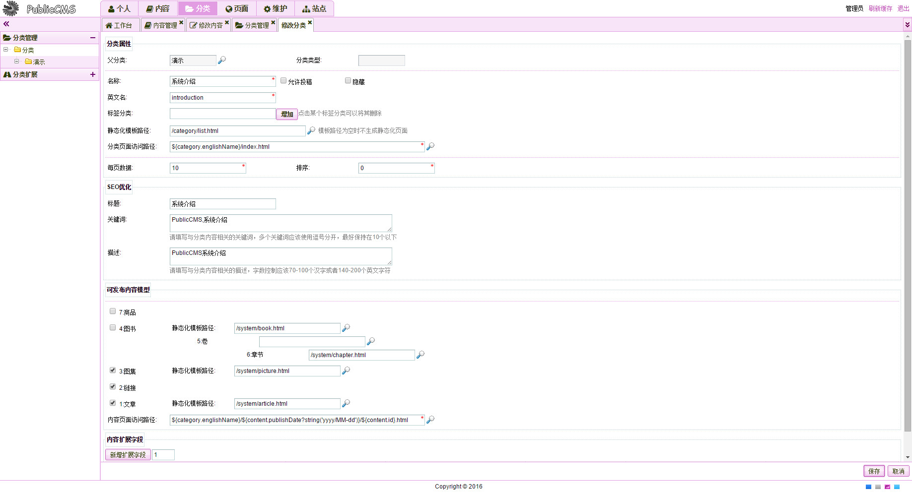
###页面推荐位管理
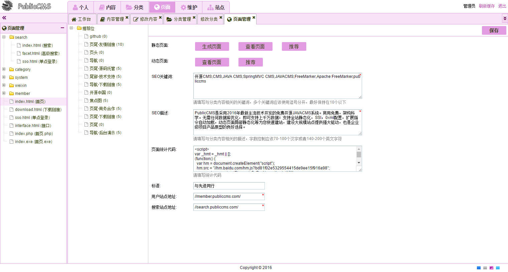
###模板在线编辑
通过模板的include和SSI(服务器端包含)实现模板片段，页面片段的最大程度复用
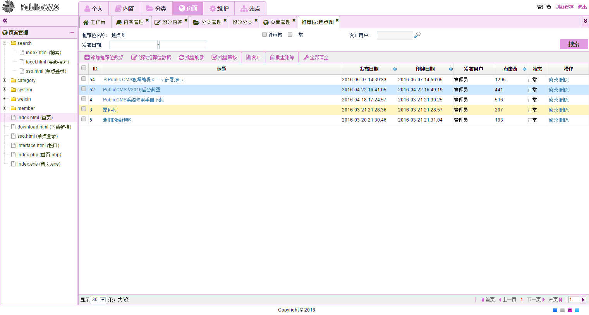
###模型管理
模型支持4个可查询系统扩展字段，和无限自定义字段扩展
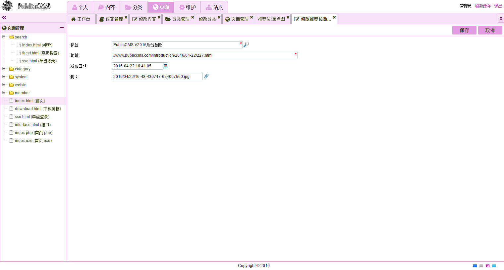
###任务计划管理
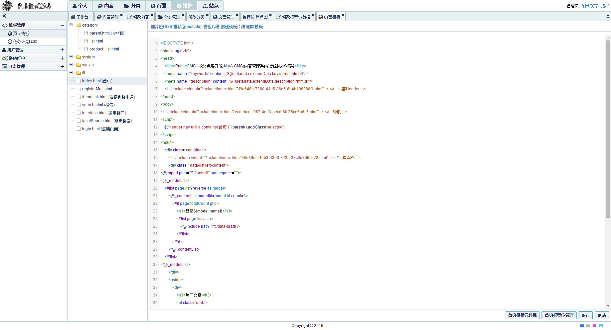
###任务计划编辑
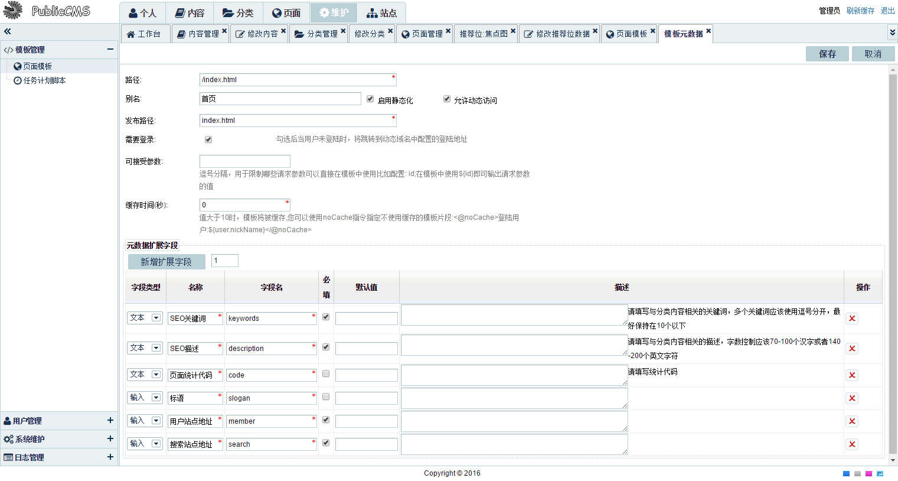
###用户管理
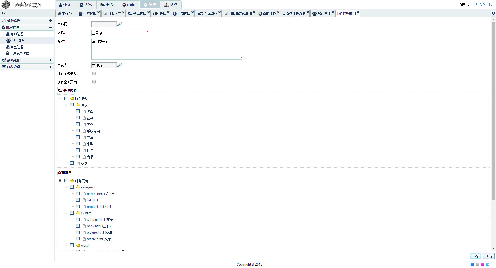
###角色编辑
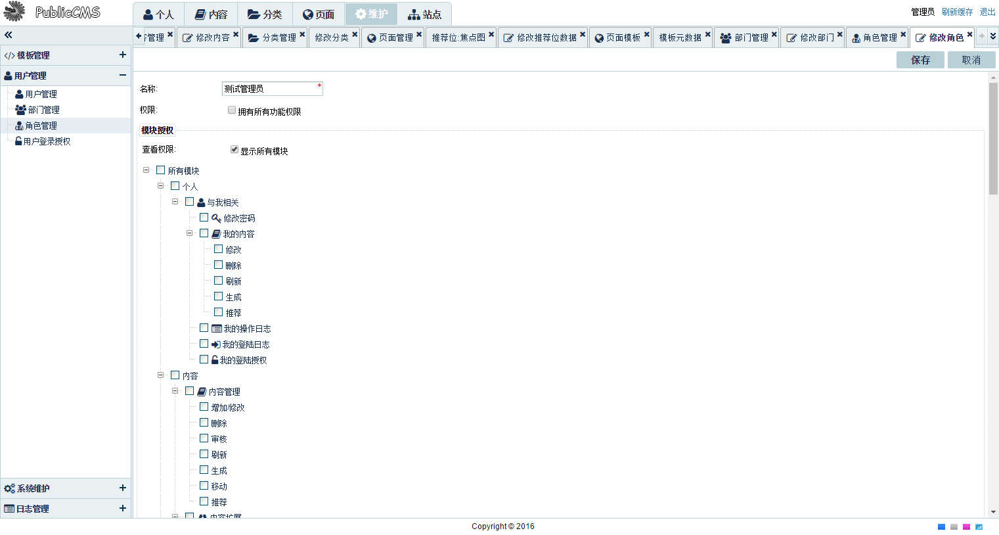
###日志管理
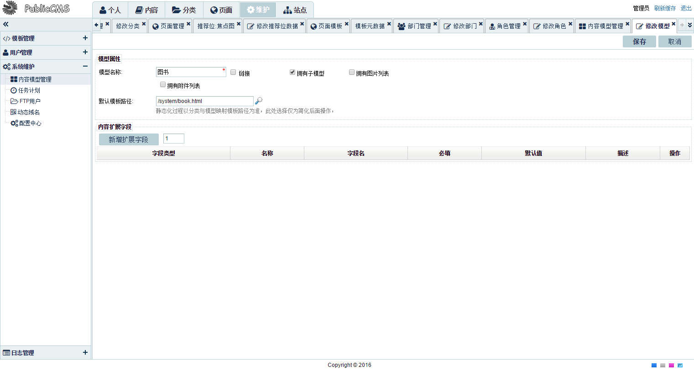