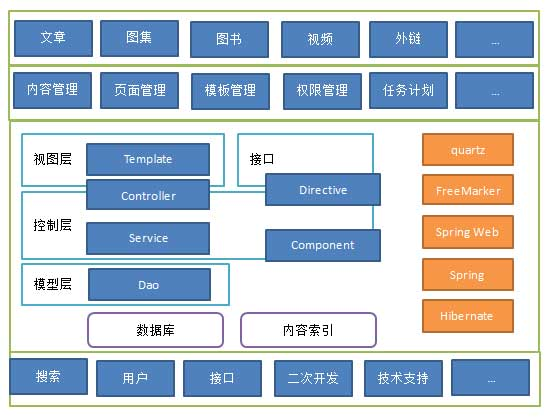
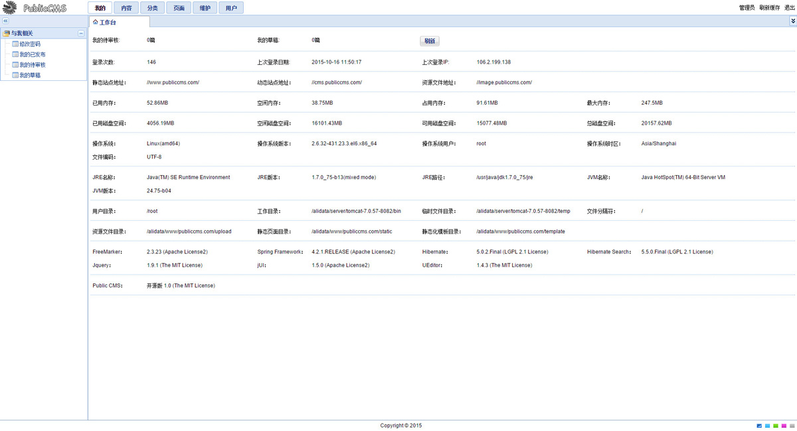
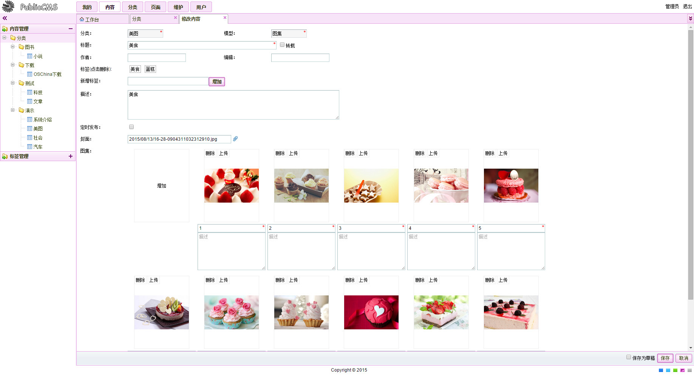
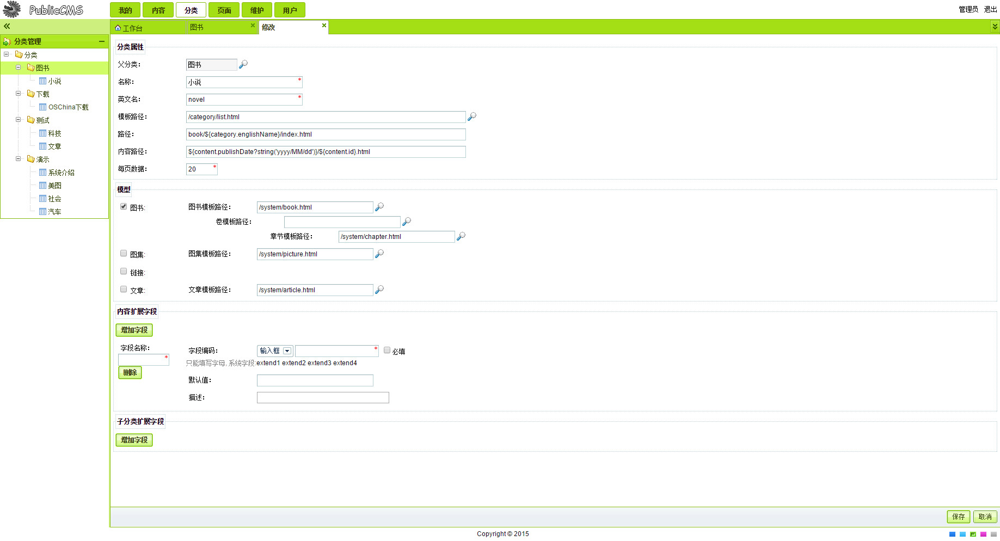
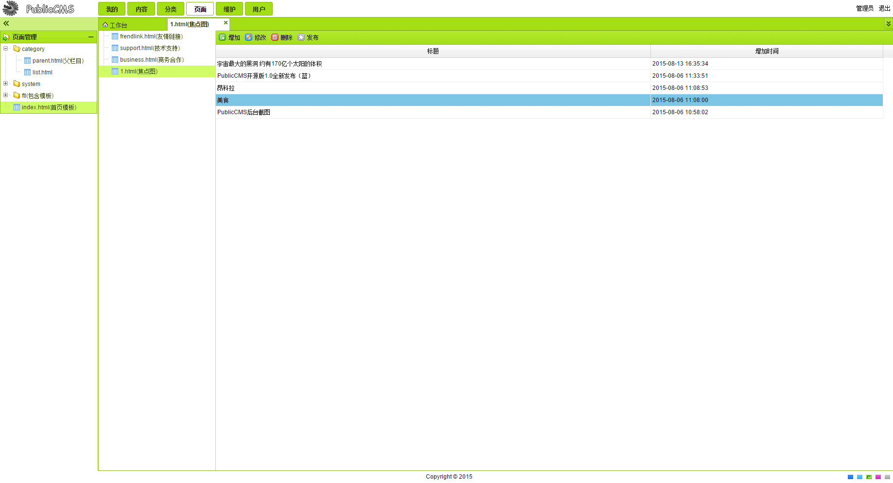
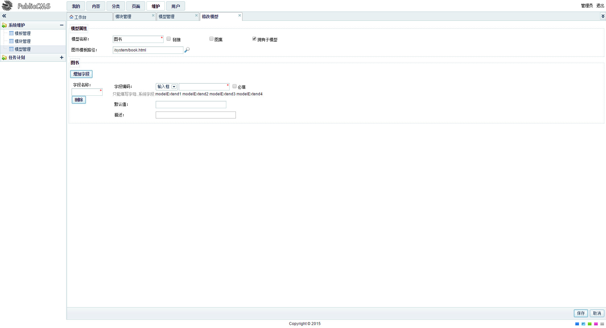
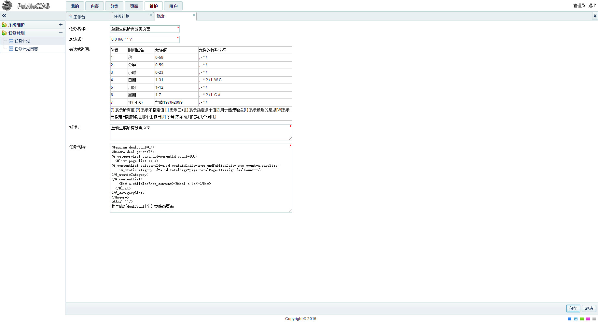
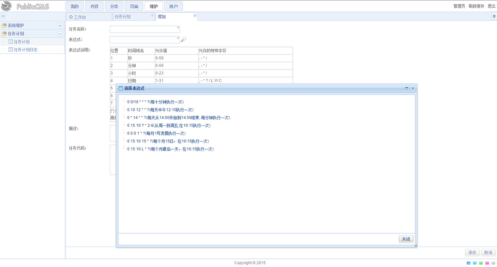

#PublicCMS

<a target="_blank" href="http://shang.qq.com/wpa/qunwpa?idkey=8a633f84fb2475068182d3c447319977faca6a14dc3acf8017a160d65962a175"></a>

##功能列表

* 内容管理
* 分类管理
* 标签管理
* 标签分类管理
* 页面管理
* 模板管理
* 模型管理
* 模块管理
* 任务计划管理
* 用户管理
* 部门管理
* 角色管理
* 日志管理

##简介

PublicCMS 使用了SpringMVC 4.2.3.RELEASE,Hibernate 5.0.5.Final,Apache FreeMarker 2.3.23,hibernate-search5.5.1.Final等技术及框架,工程编译等工作由Gradle或Maven处理，运行部署需要jdk1.7+,tomcat7.0+/jetty8.0+,nginx/apache,mysql5.0+（其他类型数据库需要自己修改方言等配置）
通过不同的配置方式PublicCMS 支持全站静态化/全站动态。
PublicCMS 采用模板等文件与工程分离的方式，会增加配置难度，但是有利于以后工程升级工作。

##授权

该软件永久开源免费(MIT 授权协议)

##结构说明

* publiccms 为JAVA Web工程，其中包含了管理后台和前台站点的动态部分
* publiccms-by-gradle 为Gradle管理的工程，publiccms-by-maven为Maven管理的工程，两个工程中源码是一样的
* data/www/publiccms.com 为PublicCMS的 数据目录其中：static子目录为静态化页面文件存储目录，upload上传文件与站点其他静态资源存储目录，template为静态化页面模板文件存储目录，data/indexes子目录为Hibernate Search/lucene索引文件目录，data/pages子目录为PublicCMS推荐位数据存储目录
* nginx-conf 为PublicCMS的nginx配置文件，该文件为本开源项目 http://www.publiccms.com/ 官网使用的配置文件副本
* database/Database Init.sql 为PublicCMS项目数据库初始化脚本，Database Change Log.sql 为数据库变更记录

##编译部署

* publiccms-by-gradle 工程编译(eclipse为例)：选择工程，右键弹出菜单中选择"Run As",在子菜单中选择"Gradle build"，在弹出的对话框中输入"war",点击按钮"Run"。在Console中可以看到编译过程日志，如果编译成功，您可以在工程下面 build/lib 目录下找到编译完成的 war包
* publiccms-by-maven 工程编译(eclipse为例)：选择工程，右键弹出菜单中选择"Run As",在子菜单中选择"Maven install"。在Console中可以看到编译过程日志，如果编译成功，您可以在工程下面 target 目录下找到编译完成的 war包
* 请根据实际情况修改数据库配置文件publiccms/src/config/properties/dbconfig.properties
* PublicCMS 支持全站静态化，如果您打算使用静态化、SSI技术，推荐您使用nginx发布PublicCMS生成的静态页面，和其他静态资源文件
* 静态化模板文件路径、静态页面文件路径、静态站点域名等信息需要同时修改 publiccms/src/config/properties/other.properties 和 nginx配置文件
* 内置管理员账号admin，密码admin
* 如果您没有使用过gradle或者maven，并且不打算使用它们，也可以在https://github.com/sanluan/PublicCMS-lib 或 https://git.oschina.net/sanluan/PublicCMS-lib 下载PublicCMS依赖的库，将其放在工程的WEB-INF\lib 目录下，并加入到build path中




##演示

* 演示站点：http://www.publiccms.com/
* 动态站点演示：http://cms.publiccms.com/
* 后台演示：http://cms.publiccms.com/admin/ 账号/密码 test/test
* 接口演示：http://cms.publiccms.com/interface.html

##二次开发

* PublicCMS提供了极其强大的指令工作方式
  您只需继承BaseDirective类，加上 @Component 注解，并实现 public void execute(RenderHandler handler) throws IOException, Exception 方法，即可在模板，接口，任务计划中使用该指令。
  在类中您可以像在Controller中那样使用Service

指令实现

```
package com.publiccms.views.directive.tools;

import java.io.IOException;
import java.util.HashMap;
import java.util.Map;

import org.springframework.stereotype.Component;

import com.sanluan.common.base.BaseDirective;
import com.sanluan.common.handler.RenderHandler;

/**
 *
 * MemoryDirective 内存指令
 *
 */
@Component
public class MemoryDirective extends BaseDirective {

    @Override
    public void execute(RenderHandler handler) throws IOException, Exception {
        Map<String, Long> map = new HashMap<String,Long>();
        map.put("free", Runtime.getRuntime().freeMemory());
        map.put("total", Runtime.getRuntime().totalMemory());
        map.put("max", Runtime.getRuntime().maxMemory());
        handler.put("object", map).render();
    }
}
```

在任何模板中使用
```
<@_memory>
	<p>
		<label>已用内存：</label>${((object.total-object.free)/1048576)?string("0.##")}MB
	</p>
	<p>
		<label>空闲内存：</label>${(object.free/1048576)?string("0.##")}MB
	</p>
	<p>
		<label>占用内存：</label>${(object.total/1048576)?string("0.##")}MB
	</p>
	<p>
		<label>最大内存：</label>${(object.max/1048576)?string("0.##")}MB
	</p>
</@_memory>
```
在接口中调用，接口形式
```
http://cms.publiccms.com/directive.json?action=memory
```
使用jsonp调用,接口形式
```
http://cms.publiccms.com/directive.json?action=memory&callback=callback
```
在任务计划中使用,任务代码：
```
<@_memory>
<#if object.free gt 512*1048576>PublicCMS占用内容已经超过512MB<#else>已用内存：${((object.total-object.free)/1048576)?string("0.##")}MB</#if>
</@_memory>
```
结合其他指令，比如您自己扩展的发送邮件指令，短信通知指令，即可实现系统监控

* PublicCMS提供动态模板统一分发请求处理
  这意味着您只需要把demo.html放到WEB-INF/web/目录下，即可使用http://domain/您的项目路径/demo.html 访问该模板，并可以通过?id=123,向模板传递一个名称为id的变量
  在模板中可以直接用${id}输出

##系统后台截图

###工作台


###内容列表


###内容编辑

编辑器为百度编辑器，支持定时发布等功能

###图集编辑


###分类编辑

分类支持4个可查询系统扩展字段，和无限自定义字段扩展

###页面推荐位管理


###模板在线编辑

通过模板的include和SSI(服务器端包含)实现模板片段，页面片段的最大程度复用

###模型管理

模型支持4个可查询系统扩展字段，和无限自定义字段扩展

###任务计划管理


###任务计划编辑


###任务计划表达式模板


###用户管理


###角色编辑


###日志管理

