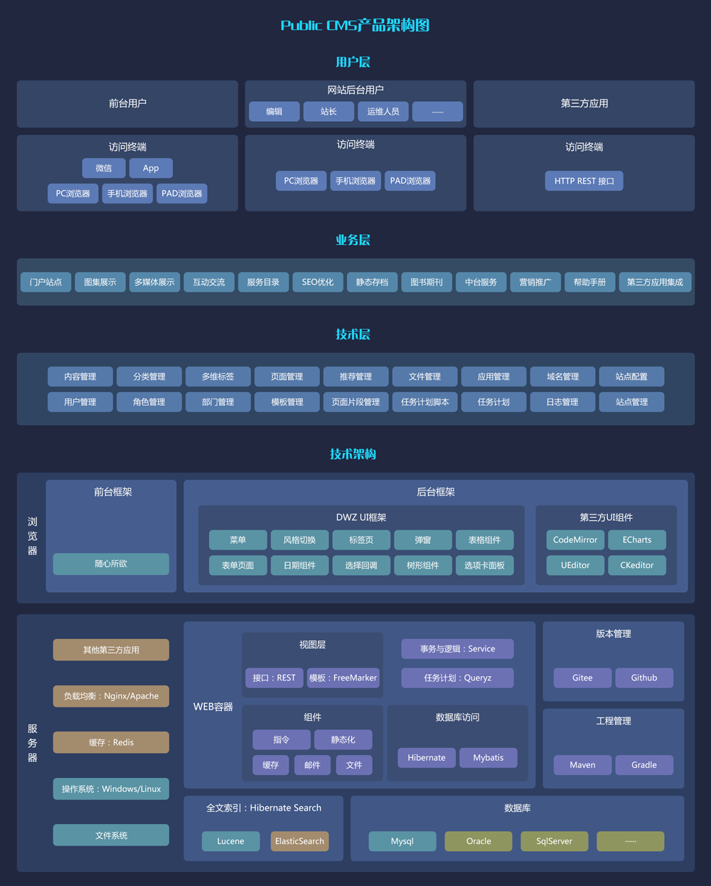
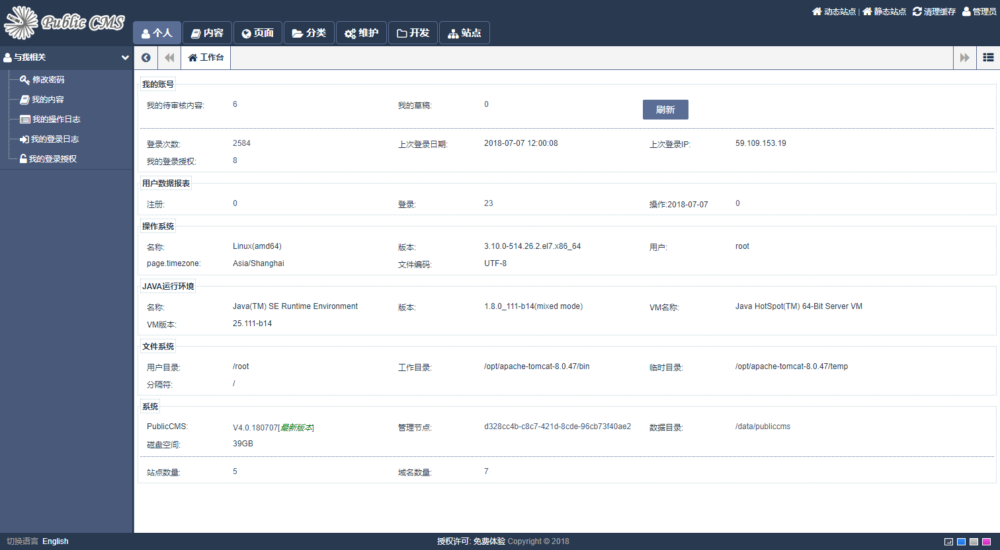
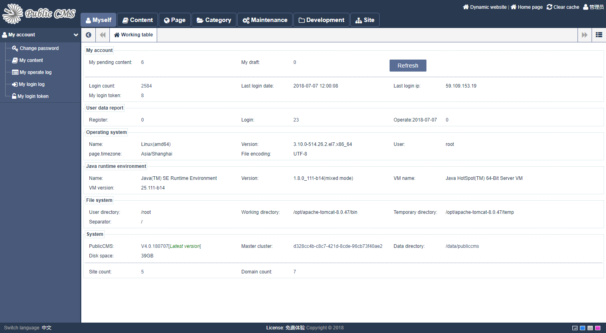
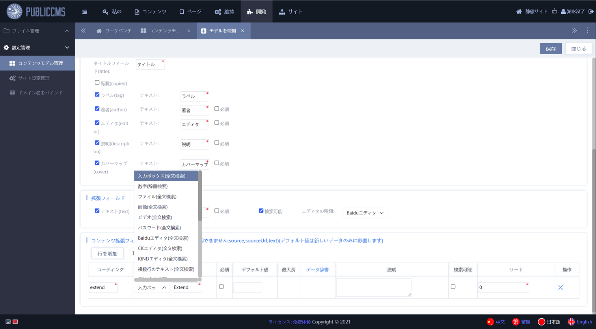

# PublicCMS V4.0

<a target="_blank" href="//shang.qq.com/wpa/qunwpa?idkey=89ffe8cd3abc04f6794965a330b0a278fdbc31f53e46fd5ee1c4f54ed43a6b28">交流群1群 191381542</a>
<a target="_blank" href="//shang.qq.com/wpa/qunwpa?idkey=088c921c4eb74328eef0192bac1e63c7228eb31b0524a373d40cdd907ddd2d3c">交流群2群 481589563</a>
<a target="_blank" href="//shang.qq.com/wpa/qunwpa?idkey=8b1c7e07973d9f9553c0b8d5f8410107c02456bf6b4674dc7e4d113266ee8e03">交流群3群 638756883</a>

## 简介

PublicCMS是采用2020年最新主流技术开发的开源JAVACMS系统。架构科学，轻松支持上千万数据、千万PV；支持全站静态化，SSI，动态页面局部静态化等为您快速建站，建设大规模站点提供强大驱动，也是企业级项目产品原型的良好选择。

## 获取源码

https://gitee.com/sanluan/PublicCMS
https://github.com/sanluan/PublicCMS

## 参与开发

切换到develop分支

## 授权协议

* 版本:V4.0 商用付费授权协议:详情参见LICENSE
* 版本:V1.0,V2016,V2017 完全免费授权协议:MIT

## 环境要求

* jdk或jre 1.8 及以上
* mysql 5.5 及以上

## 目录说明

* data\publiccms	PublicCMS数据目录
* doc			文档
* publiccms-parent	工程源码

## 快速编译与运行

* 编译运行

保证操作系统中有jdk1.8及以上
```
cd publiccms-parent
mvnw clean package
cd publiccms/target
java -jar publiccms.war
```
访问程序页面http://localhost:8080/publiccms/ ,根据页面提示配置并初始化数据库
管理后台访问相对路径为http://localhost:8080/publiccms/admin/ ,数据脚本内置管理员账号/密码:admin/admin
* 直接下载网盘中可执行程序(https://www.publiccms.com/download.html)
本地准备java,mysql环境,下载可执行程序压缩解压缩后运行startup.bat或startup.sh

## 定制运行方式

* windows启动命令

```
java -jar -Dcms.port=8080 -Dcms.contextPath=/publiccms -Dcms.filePath="%cd%\data\publiccms" publiccms.war
```
* linux启动命令
```
java -jar -Dcms.port=8080 -Dcms.contextPath=/publiccms -Dcms.filePath="`pwd`/data/publiccms" publiccms.war
```
更多参数及含义请参考部署手册

* tomcat中运行
将publiccms.war.original重命名为publiccms.war或ROOT.war(上下文路径为/),移动文件到tomcat的webapps目录下,此时-Dcms.filePath参数依旧有效
* docker中运行
直接执行:
```
docker run -d -p 8080:8080 sanluan/publiccms

```
自行构建镜像:执行
```
docker build -t mypubliccms .
docker run -d -p 8080:8080 mypubliccms

```
更多参数及含义请参考 https://hub.docker.com/r/sanluan/publiccms/

## 演示

* 演示站点：https://www.publiccms.com/
* 后台演示：https://cms.publiccms.com/admin/ 演示账号/密码 test/test
* 接口演示：https://cms.publiccms.com/interface.html


## Public CMS架构图



## Public CMS管理后台



## Public CMS Management



## Public CMS 管理バックグラウンド

