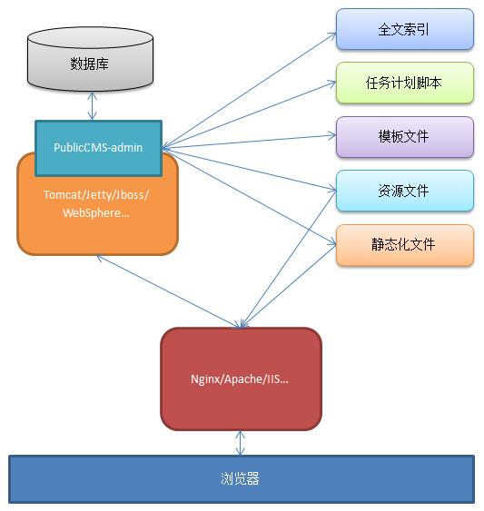
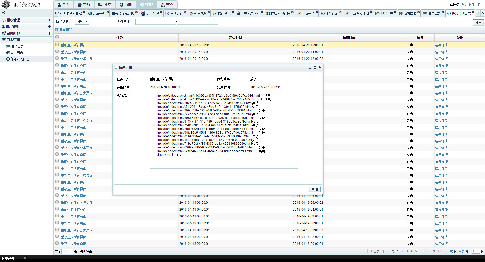

#PublicCMS

##简介

PublicCMS是采用2016年最新主流技术开发的免费开源JAVACMS系统。商用免费，架构科学。无需任何数据库优化，即可支持上千万数据；支持全站静态化，动态页面缓存，SSI，0xml配置，扩展指令自动加载等为您快速建站，建设大规模站点提供强大驱动，也是企业级项目产品原型的良好选择。

##获取可运行程序

http://git.oschina.net/sanluan/PublicCMS-war

https://github.com/sanluan/PublicCMS-war

##参与研发(预览版)

http://git.oschina.net/sanluan/PublicCMS-preview

https://github.com/sanluan/PublicCMS-preview

##相关下载及文档(知识库)

https://github.com/sanluan/PublicCMS-lib

https://git.oschina.net/sanluan/PublicCMS-lib

##授权

该软件永久开源免费(MIT 授权协议)

##结构说明

* publiccms-by-gradle 为Gradle管理的工程，publiccms-by-maven为Maven管理的工程，两个工程中源码是一样的
* data/publiccms 为PublicCMS的 数据目录
* database/Database Init.sql 为数据库初始化脚本，Database Change Log.sql 为数据库变更记录

##部署运行

* 根据文档部署工程
* 数据脚本内置管理员账号admin，密码admin

##演示

* 演示站点：http://www.publiccms.com/
* 动态站点演示：http://cms.publiccms.com/
* 后台演示：http://cms.publiccms.com/admin/ 账号/密码 test/test
* 接口演示：http://cms.publiccms.com/interface.html

##更新记录

###V2016.0828更新：

框架升级:

1. Spring Framework升级到4.3.2
1. Hibernate Search升级到5.5.4
1. Hibernate升级到5.1.1
1. FreeMarker升级到2.3.25-incubating
1. Jackson升级到2.8.1

BUG修复:

1. 分类扩展字段展示错误修复
1. 内容推送到页面时标题乱码修复
1. 域名管理错别字修改
1. Nginx建议配置页面错误修复
1. 多数据源支持增加复位操作
1. 任务计划脚本修改路径错误修复
1. 域名绑定子目录时元数据路径错误修复
1. 模板编辑推荐位页面不能选择使用推荐位错误修复
1. 用户名密码等去空格处理
1. FTP服务LIST命令报文修复
1. 前台站点数字超千位输出错误

新增功能:

1. 新增配置中心
1. 将文件上传日志拆分为独立的表
1. 增加集群管理，任务计划集群环境处理
1. 后台增加JSP视图解决方案
1. 增加管理站点后台Public CMS新版本提示
1. 搜索词统计
1. 分类增加外链类型
1. 模块图标拆分为单独字段，图标直接选择使用
1. 增加日志配置文件

其他提升:

1. 后台当前站点信息提示
1. 后台工作台取消框架版本信息显示
1. 常量引用改完get方法方式
1. 接口改完restfull风格
1. 取消普通接口鉴权
1. 接口测试页面合并为一个，增加需要鉴权等提示
1. 取消文件列表缓存
1. getPageDataAttribute改为getPlaceAttribute
1. 将内容、用户、标签等数据ID改为long存储
1. 后台模板安全性提升
1. UI修改
1. 动态模板改完默认不允许访问
1. 动态模板可使用任何后缀

鸣谢：

感谢@深圳-final @日照-ゞkong.“ @辉 @隔壁邻居王先生 等群友们热心提出产品的BUG及改进建议
感谢@枫之舞 为CMS改造的UI界面(此版本只参考了部分修改)
感谢@日照-ゞkong.“ @隔壁邻居王先生 @暗亮之间 为Public CMS贡献文档

##系统后台截图

###工作台

###内容列表

###内容管理

###内容编辑

编辑器为百度编辑器，支持定时发布等功能

###页面元数据管理

###页面推荐位管理

###模板在线编辑

通过模板的include和SSI(服务器端包含)实现模板片段，页面片段的最大程度复用，模板编辑器支持FreeMarker语法与html混合高亮显示

###模板元数据管理

###部门编辑

###任务计划编辑

