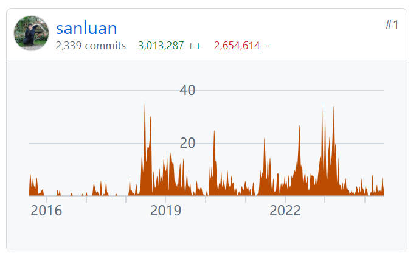

# PublicCMS

<p style="align:center">
  <a href="./README.md">English</a> | 简体中文
</p>

<a target="_blank" href="https://qm.qq.com/cgi-bin/qm/qr?k=xoxCUvv7bDCFQ8AAqaoWB1JsLz0L90qn">交流1群</a> 191381542
<a target="_blank" href="https://qm.qq.com/cgi-bin/qm/qr?k=x15JZdCp8vWlxV1mMoMTyrHzMqw3dmI1">交流2群</a> 481589563
<a target="_blank" href="https://qm.qq.com/cgi-bin/qm/qr?k=VogNtcpFOLxvjtvzUcAElZOK-KC4To_u">交流3群</a> 638756883
<a target="_blank" href="https://qm.qq.com/cgi-bin/qm/qr?k=lsFbfVpj3yqWuY92GYkOG1esbyPNS7O3">交流4群</a> 930992232

## 简介

PublicCMS是采用2023年主流技术开发的开源JAVACMS系统。由天津黑核科技有限公司开发，架构科学，轻松支撑上千万数据、千万PV；支持可视化编辑，多维扩展，全文搜索，全站静态化，SSI，动态页面局部静态化，URL规则完全自定义等为您快速建站，建设大规模站点提供强大驱动，也是企业级项目产品原型的良好选择。

## 获取源码

https://gitee.com/sanluan/PublicCMS
https://github.com/sanluan/PublicCMS

## 参与开发

切换到develop,V5-develop分支,免费版本切换到V2019分支


## 授权协议

* 版本:V4.0,V5 个人免费,企事业单位付费 授权协议:详情参见LICENSE
* 版本:V1.0,V2016,V2017,V2019 完全免费 授权协议:MIT

## 环境要求

* V4.0 jdk或jre 1.8 及以上,V5 Java17及以上
* mysql 5.5 及以上

## 目录说明

* data\publiccms	PublicCMS数据目录
* doc			文档
* publiccms-parent	工程源码

## 快速编译与运行

* 编译运行

保证操作系统中有jdk1.8及以上,V5 Java17及以上
```
cd publiccms-parent
mvnw clean package
cd publiccms/target
java -jar publiccms.war
```
访问程序页面http://localhost:8080/ ,根据页面提示配置并初始化数据库

管理后台访问相对路径为http://localhost:8080/admin/ ,数据脚本内置管理员账号/密码:admin/admin

* 直接下载可执行程序(https://www.publiccms.com/download.html)

本地准备java,mysql环境,下载可执行程序压缩解压缩后运行startup.bat或startup.sh

## 定制运行方式

* windows启动命令

```
java -jar -Dfile.encoding="UTF-8" -Dcms.port=8080 -Dcms.contextPath=/publiccms -Dcms.filePath="%cd%\data\publiccms" publiccms.war
```
* linux启动命令
```
java -jar -Dfile.encoding="UTF-8" -Dcms.port=8080 -Dcms.contextPath=/publiccms -Dcms.filePath="`pwd`/data/publiccms" publiccms.war
```
更多参数及含义请参考部署手册

* tomcat中运行
将publiccms.war.original重命名为publiccms.war或ROOT.war(上下文路径为/),移动文件到tomcat的webapps目录下,此时-Dcms.filePath参数依旧有效
* docker中运行

执行:
```
docker run -d -p 8080:8080 sanluan/publiccms

```
自行构建镜像

执行:
```
docker build -t mypubliccms .
docker run -d -p 8080:8080 mypubliccms

```
* docker compose中运行

执行:
```
docker compose up -d

```
mysql ip/端口: mysql-cms/3306 ; 数据库: publiccms ; 用户名/密码: publiccms/password!@#

更多参数及含义请参考 https://hub.docker.com/r/sanluan/publiccms/

## 演示

* 演示站点：https://www.publiccms.com/
* 后台演示：https://cms.publiccms.com/admin/ 演示账号/密码 test/test
* 接口演示：https://cms.publiccms.com/interface.html


## Public CMS架构图


## Public CMS管理后台 - 中文


## Public CMS管理後臺 - 繁體


## Public CMS Management - English


## Public CMS 管理バックグラウンド - 日本語

